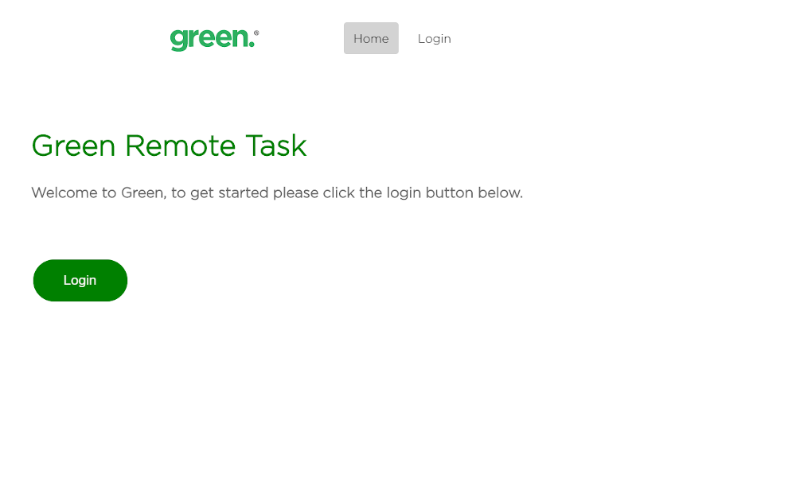
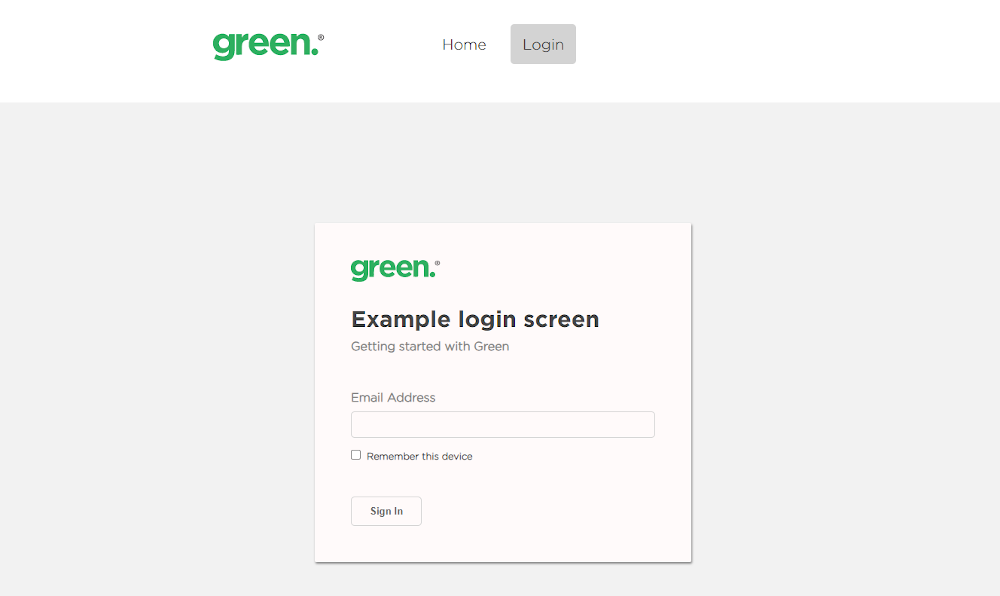

# Green_Remote_Task

Remote task created with a basic landing page using react router and a login page created from a given design.

Taking into account:

- UX/UI
- Responsive Design
- Fonts
- Client Design Requests

Basic landing page added

Login form created

